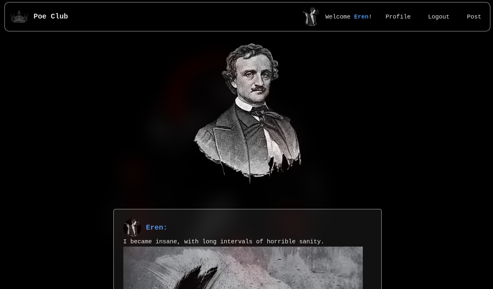

# PoeClub (VipClub)
LIVE DEMO : https://poeclub.vercel.app

Short description
- A small social app where users sign in with Google and share messages. You can attach images/videos to posts, like posts, and add comments. Includes a simple profile page and an admin-only delete action.

## 🧰 Tech Stack

Frontend
- React 19 (Vite 7)
- React Router
- Context API
- Tailwind CSS 4 (@tailwindcss/vite)
- Google OAuth: @react-oauth/google

Backend
- Node.js, Express 5
- PostgreSQL (pg)
- CORS, dotenv
- Serverless deployment: Vercel Functions (api/index.js)

Media/Storage
- Cloudinary (unsigned upload, preset: poeclub)

Tooling
- Vite, ESLint, Tailwind CSS
- Deployment: Vercel